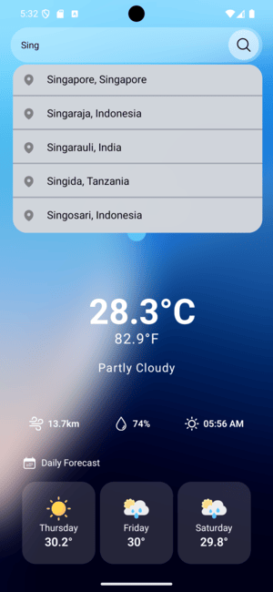
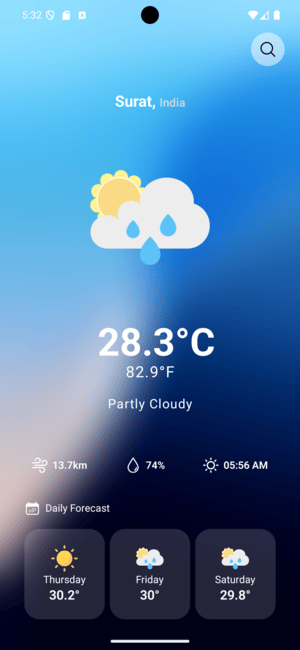

# 🌤️ Weather App

A beautiful, fast, and animated React Native weather app powered by [WeatherAPI.com](https://www.weatherapi.com/).  
Search for any city to view real-time weather data, forecasts, and more — all presented with smooth animations and a sleek UI.

---

## Features

- **Search Functionality**  
  Instantly search and select any city to view its weather.

- **Temperature Details**  
  Displays temperature in both **Celsius** and **Fahrenheit**.

- **Current Weather Conditions**  
  Shows weather condition with dynamic weather icons and descriptions.

- **Wind Speed, Humidity & Sunrise Time**  
  Real-time display of wind (in km/h), humidity (%), and sunrise timing.

- **3-Day Forecast**  
  Get the average temperature forecast for **today and the next 2 days**, displayed with animated cards.
  
- **Async Storage**  
  Uses async storage to remember users' preferences.
---

## 📸 Screenshots

 

---

## 🚀 Installation

> **Note:** Make sure you have **Node.js**, **Expo CLI**, and a working Android/iOS simulator or real device.

1. **Clone the repository**

```bash
git clone https://github.com/yourusername/weather-app.git
cd weather-app
```

2. **Set Up API Key**
- Create a .env file in the root of the project.
- Get your own API from [WeatherAPI.com](https://www.weatherapi.com/).

3. **Install Dependencies and Run the App**
```bash
npm install
npm run android
```


